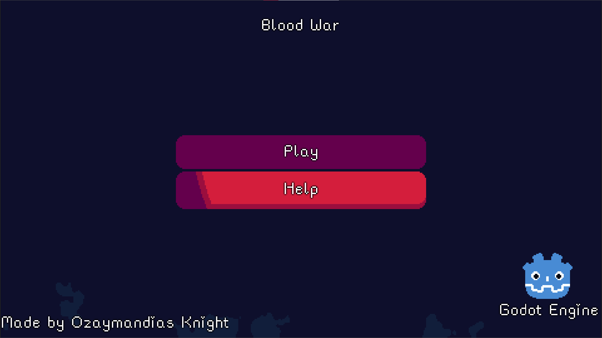
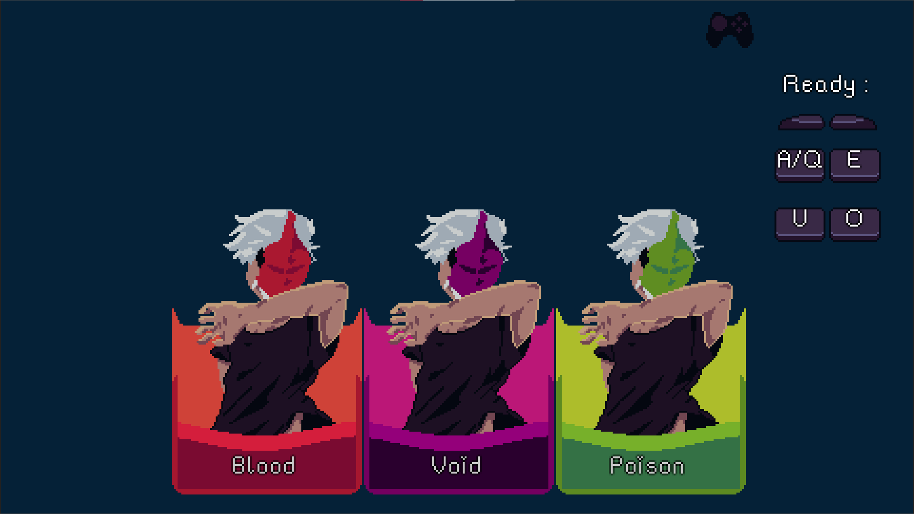
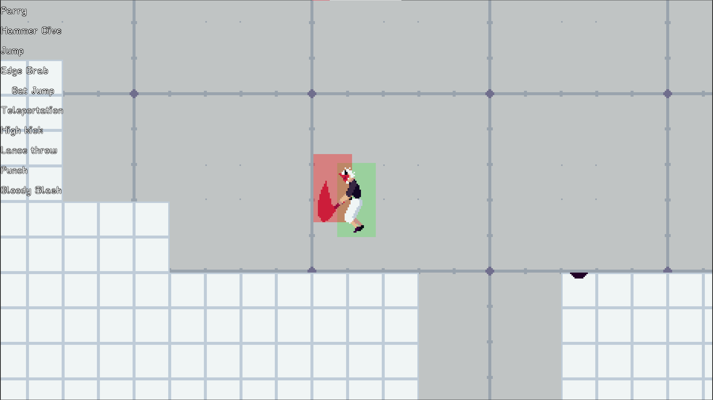
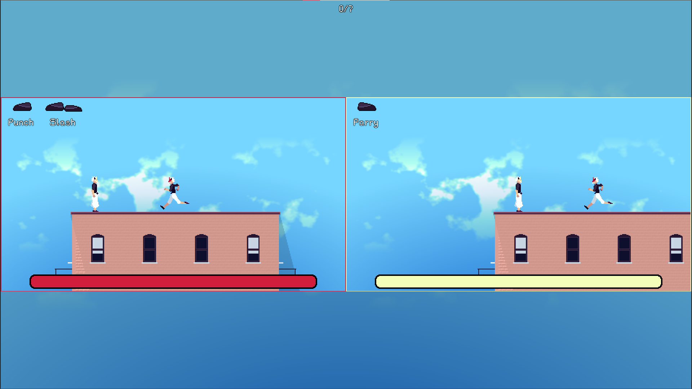
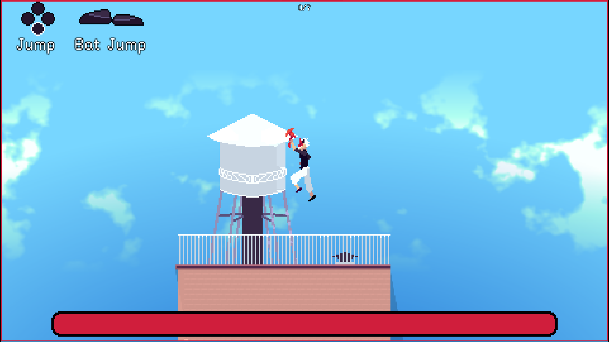
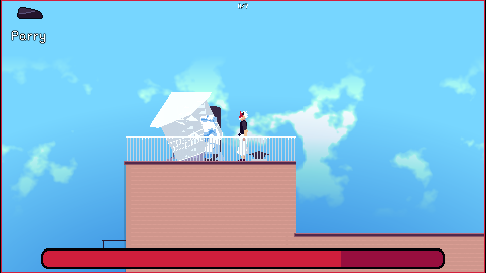

It's a fighter game in local multiplayer, with possibility to play alone.

Main Title

Character Selection (when we click on "Play", controller support up to 4 players, with 2 players on keyboard, AZEQSD/Shift and UIOJKL)
Player 1 Keyboard : Press A and E to be ready
Player 2 Keyboard : Press U and O to be ready
Players on controllers : Hold both ZR and ZL (L2 and R2)

Displaying the moves of your characters and their hitboxes/hurtboxes, change move in the list using Q and D (Shown when we click on "Help")

In game view, with two players

It uses normal maps and directionnal 2D light to convey a fake sense of lightning

The game contain a single prop that is destructible, water was made using GPU shaders along with the clouds in the background

